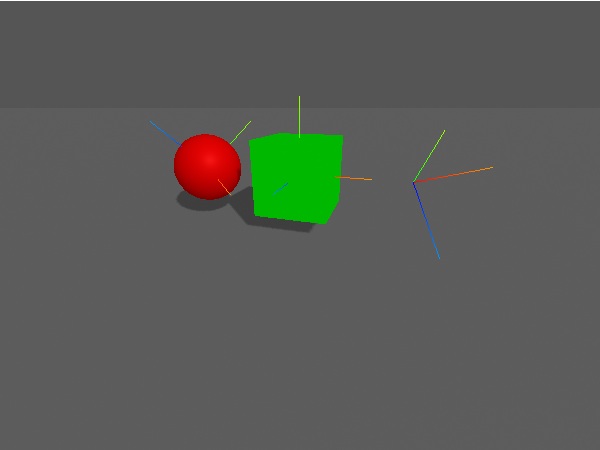

# aframe-axeshelper #

a trivial [A-Frame](https://aframe.io/) component and primitive for the [Three.js](https://threejs.org/) [AxesHelper](https://threejs.org/docs/#api/en/helpers/AxesHelper)



**NPM users**: please consider the [Github README](https://github.com/rozek/aframe-axeshelper/blob/main/README.md) for the latest description of this package (as updating the docs would otherwise always require a new NPM package version)

## Installation ##

`aframe-axeshelper` may be used as an ECMAScript module (ESM) or explicitly loaded after the `<script>` tag for A-Frame itself.

For the ESM variant, install the package into your build environment using [NPM](https://docs.npmjs.com/) with the command

```
npm install aframe-axeshelper
```

and `import` it into your code whereever needed

```javascript
import "aframe-axeshelper"
```

Otherwise, load the plain script file directly

```html
<script src="https://unpkg.com/aframe-axeshelper"></script>
```

## Usage ##

Once loaded or imported, you may use the `aframe-axeshelper` either as an A-Frame component (usually for an already existing A-Frame entity)

```html
<a-scene>
  <a-box axeshelper position="1 1 -3" rotation="45 30 15"/>
</a-scene>
```

or as an A-Frame primitive

```html
<a-scene>
  <a-axeshelper position="1 1 -3" rotation="45 30 15"/>
</a-scene>
```

whatever seems more appropriate.

### Example ###

Here is a complete example (albeit without the HTML boilerplate)

```html
<script src="https://unpkg.com/aframe"></script>
<script src="https://unpkg.com/aframe-axeshelper"></script>

<a-scene>
  <a-sky color="#555555"></a-sky>

  <a-entity light="type:ambient; color:#BBBBBB"></a-entity>
  <a-entity light="type:directional; intensity:0.6; castShadow:true"
    position="1 1 1"></a-entity>

  <a-plane width="1000" height="1000" color="#555555" shadow="receive:true"
    position="0 0 0" rotation="-90 0 0"></a-plane>

  <a-sphere radius="0.5" material="color:#AA0000" shadow="cast:true"
    axeshelper position="-1.5 0.8 0" rotation="-45 -30 -15"></a-sphere>
  <a-box                 material="color:#00AA00" shadow="cast:true"
    axeshelper position="0    0.8 0"></a-box>
  <a-axeshelper radius="0.5" material="color:#0000CC" shadow="cast:true"
    position="1.5  0.8 0" rotation="45 30 15"></a-axeshelper>
</a-scene>
```

## Build Instructions ##

You may easily build this package yourself.

Just install [NPM](https://docs.npmjs.com/) according to the instructions for your platform and follow these steps:

1. either clone this repository using [git](https://git-scm.com/) or [download a ZIP archive](https://github.com/rozek/aframe-axeshelper/archive/refs/heads/main.zip) with its contents to your disk and unpack it there 
2. open a shell and navigate to the root directory of this repository
3. run `npm install` in order to install the complete build environment
4. execute `npm run build` to create a new build

You may also look into the author's [build-configuration-study](https://github.com/rozek/build-configuration-study) for a general description of his build environment.

## License ##

[MIT License](LICENSE.md)
